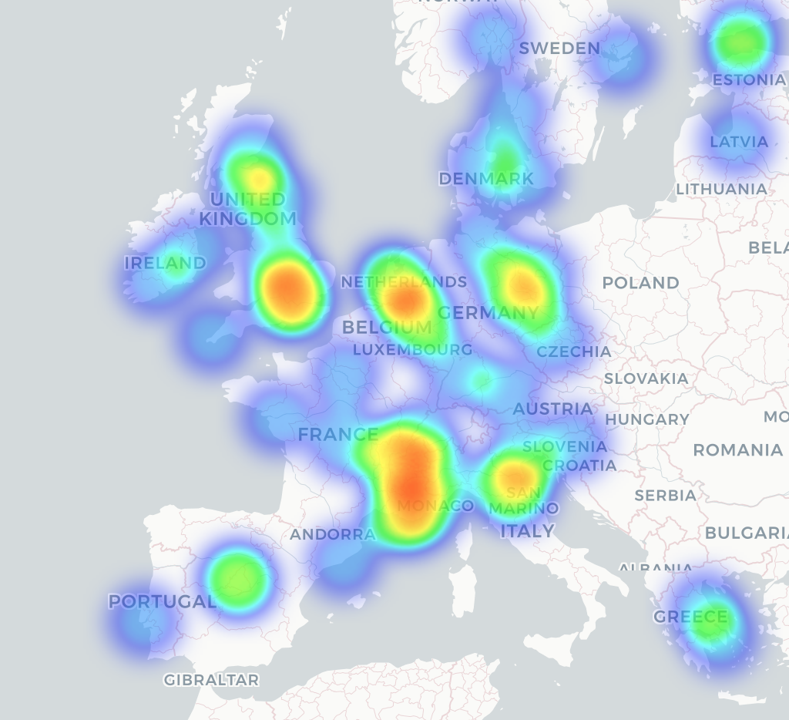
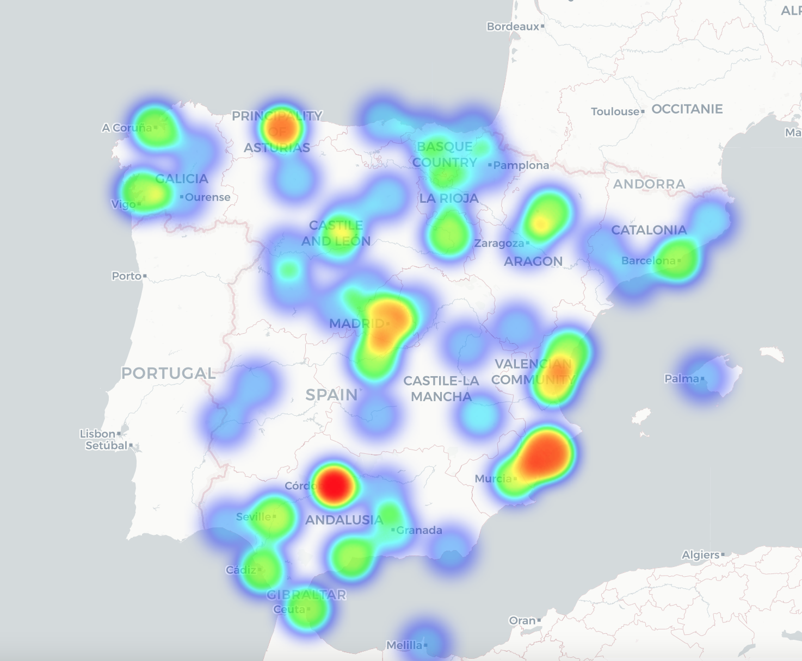
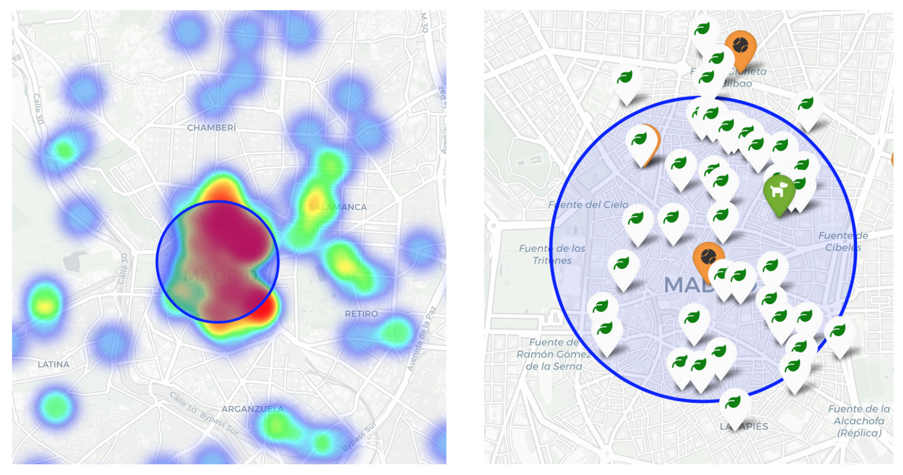
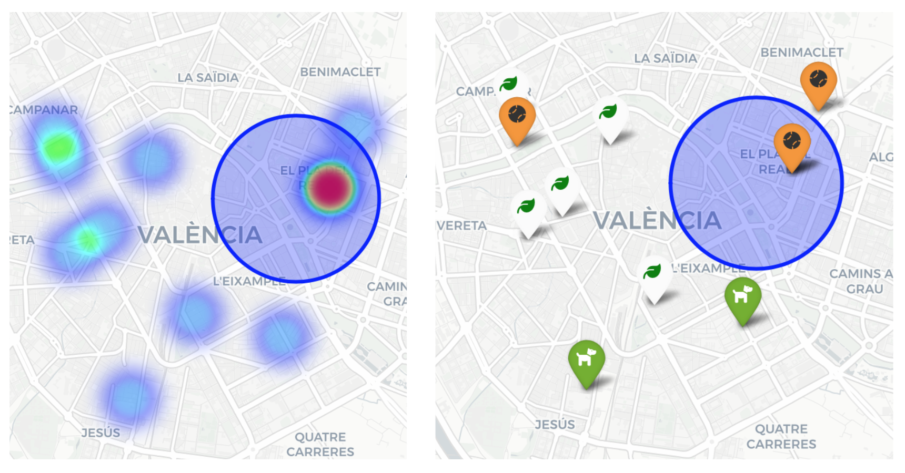
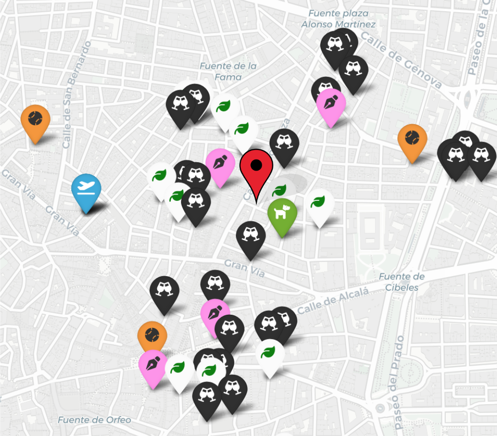

# Office Location: 

## Table of Contents:

1. [Introduction](#introduction)
2. [Available Resources](#available-resources)
3. [Approach](#approach)
4. [Workflow] (#workflow)
    - [European Country Exploration: Sector enterprise density](#european-country-exploration-sector-enterprise-density)
    - [Cities Exploration](#cities-exploration)
    - [Comparing Suitable Cities](#comparing-suitable-cities)
    - [Defining the Neighborhood](#defining-the-neighborhood)
4. [Conclusion](#conclusion)

## 1. Introducción: 

We’ve been ask to find the perfect location for a gaming company. Para esta tarea tendremos en cuenta distintas prioridades que nos han marcado  desde la dirección de la empresa. 

**Located in Europe**: Prioritizing  location that offers fewer gaming companies nearby, thus presenting a strategic market opportunity while minimizing competitive pressures.
**Access to talent**: In light of the company's strategic expansion objectives,  the chosen city has to be able to provide a constant flow of talent.

Additionally, they company share with us some relevant information about their employees to helps us with the search:

- Everyone in the company is between 25 and 40 years old.
- The team loves their office dog, "Dobby."
- 1 CEO/President, that is vegan.
- 1 Maintenance staff member, that loves sports.
- 10 Executives love Starbucks A LOT.
- 15 Frontend/Backend Developers
- 20 Account Managers need to travel a lot.
- 20 Designers , appreciate near design enviroments

## 2. Available Resources: 

- Foursquare API
- MongoDB ("companies" collection)

## 3. Aproach: 
Considering various variables from most to least essential, we will narrow down the area in which we want to locate our company. To do this, we will follow these three steps repeatedly:

- Extract
- Describe
- Analize

## 4. WorkFlow: 

### 4.1 European Country Exploration: Sector enterprise density. 
Extract Gaming-related companies locations frm companies collection in Mongo DB

Sector enterprise density (Heat Map)

Spain emerges as a suitable country for gaming enterprises.

### 4.2 Cities exploration: 
Extract university and educational related locations from a forestare API 

University and educational location  densisty (Heat Map)

An in-depth examination of the educational landscape surrounding Madrid and Valencia is underway.

### 4.3 Comparing Suitable Citys: 
Para profundizar en la búsqueda y ayudarnos a la toma de decision se han considerado tres de los requisitos de los empleados para analizar las dos posibles ciudades. 
In this case, our focus lies on evaluating amenities such as sports facilities, dog parks, and vegan restaurants.

**MADRID** 

**VALENCIA** (Tags Map)

We see much less density of requirements in Valencia, so it may not be a good idea to continue with this city as a candidate.

### 4.4 Defining the Neighborhood:  
We have decided that Madrid will be the chosen city, but now we must define in which area/neighborhood of Madrid we want to locate.

In this case, we will analyze the presence of cafes, nightlife venues, communication zones, and other design companies. to ry to find a suitable spot were mostly of the company employees can have one of their preferred spots near.

## 5. Conclusion: 

Through analysis, Spain emerged as a promising country for our venture, with Madrid ultimately chosen over Valencia due to its richer amenities. We meticulously evaluated various neighborhoods within Madrid, considering factors like cafes, nightlife, communication zones, and proximity to design companies. Our approach ensures a suitable environment that aligns with the preferences and needs of our diverse team.

